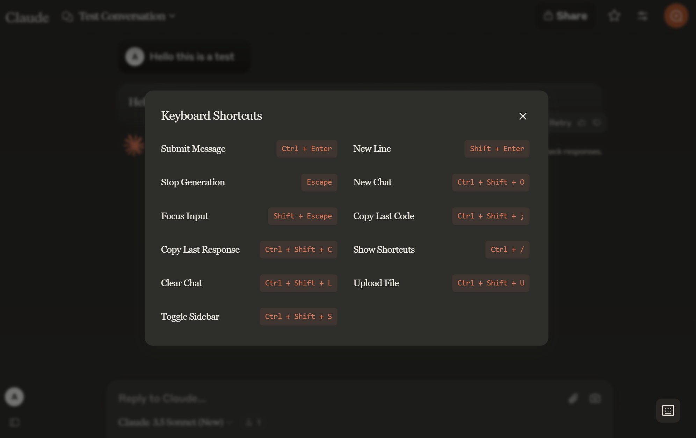

<div align="center">
  
  <h1>Claude UI Shortcuts</h1>
  <p>
    <b>Enhance your Claude AI experience with keyboard shortcuts</b>
  </p>
  <p>
    
    
    
  </p>
</div>

---

<div align="center">
  
</div>

## ✨ Features

### Core Features
- 🎯 Matches ChatGPT's default keyboard shortcuts
- ⌨️ Fully customizable shortcuts
- 🎨 Clean, minimalist interface matching Claude's design
- 💾 Automatic shortcut sync across devices
- 📋 Quick copy functionality for code and responses
- 🔍 Easy-to-access shortcuts viewer (Ctrl + / or floating button)

### Enhanced Functionality
- **Multiple Access Points**: Access shortcuts via keyboard (Ctrl + /), extension icon, or floating button
- **Robust Submit Command**: Works across all viewport sizes (including mobile view)
- **Multiple Submit Methods**: Uses both button click and native event dispatch for maximum reliability
- **Smart Response Tracking**: Automatically tracks the latest response and code blocks
- **Adaptive UI**: Modal interface that matches Claude's aesthetic
- **State Persistence**: Maintains shortcut configurations across sessions

## Default Shortcuts

| Action | Shortcut |
|:-------|:---------|
| Submit Message | `Ctrl + Enter` |
| New Line | `Shift + Enter` |
| Stop Generation | `Escape` |
| New Chat | `Ctrl + Shift + O` |
| Focus Input | `Shift + Escape` |
| Toggle Sidebar | `Ctrl + Shift + S` |
| Copy Last Code | `Ctrl + Shift + ;` |
| Copy Last Response | `Ctrl + Shift + C` |
| Show Shortcuts | `Ctrl + /` |
| Clear Chat | `Ctrl + Shift + L` |
| Upload File | `Ctrl + Shift + U` |

## 🚀 Installation

1. Clone this repository or download the ZIP file
2. Open Chrome and navigate to `chrome://extensions/`
3. Enable "Developer mode" in the top right
4. Click "Load unpacked" and select the extension directory

## 🎨 Brand Colors

The extension uses Claude's official brand colors:

```css
/* Primary Colors */
--terra-cotta: #da7756;
--terra-cotta-dark: #bd5d3a;
--background: #eeece2;
--text: #3d3929;
```

## 🛠️ Development

### Prerequisites

- Google Chrome
- Basic knowledge of JavaScript
- Understanding of Chrome Extension APIs

### Local Development

1. Make changes to the source files
2. Go to `chrome://extensions/`
3. Click the refresh icon on the extension card
4. Test your changes on [Claude AI](https://claude.ai)

## 📁 Files Structure

```
claude-shortcuts/
├── manifest.json        # Extension configuration
├── content.js          # Main shortcut functionality
├── background.js       # Extension button handler
├── ui-components.js    # Shared UI components
├── options.html        # Settings page layout
├── options.js         # Settings page functionality
├── generate_icon.py   # Icon generation script
└── icons/            # Extension icons
    ├── icon16.png
    ├── icon32.png
    ├── icon48.png
    └── icon128.png
```

## 🤝 Contributing

1. Fork the repository
2. Create a new branch for your feature
3. Submit a pull request

## 📝 License

MIT License - feel free to use this code in your own projects!

## 🐛 Known Issues

- Inspired by ChatGPT's keyboard shortcuts
- Designed to match Claude AI's aesthetic
- Built with vanilla JavaScript for maximum performance

## Support

If you encounter any issues or have suggestions:
1. Open an issue on GitHub
2. Provide detailed steps to reproduce the problem
3. Include your Chrome version and OS

## Planned Features 🚀

### Future Enhancements
- Implement toggle for Claude's sidebar pin functionality
- Add visual feedback for shortcut actions
- Improve mobile responsiveness
- Add customizable shortcut combinations

## Known Issues 🐛

### Sidebar Toggle Limitations
- Mobile view: Opening sidebar via shortcut not working consistently
- Desktop view: Working as expected
- Current shortcut: Ctrl + Shift + S (configurable)

### Input Focus Issues
- Mobile view: Auto-focus not working after creating new chat
- Desktop view: Working as expected
- Current shortcut: Shift + Escape (configurable)

### Incomplete Features
The following shortcuts are currently not working or incomplete:
- Copy Last Code (Ctrl + Shift + ;)
- Copy Last Response (Ctrl + Shift + C)
- Clear Chat (Ctrl + Shift + L)
- Upload File (Ctrl + Shift + U)

Current challenges:
- Different DOM structure between mobile and desktop views
- Dynamic button states
- Viewport-specific behaviors
- Mobile-specific focus handling limitations
- Aria-hidden conflicts with focus management
- Response and code block tracking reliability
- Dynamic content loading detection

If you'd like to contribute to fixing these issues, please check the issues section or submit a PR!

---

<div align="center">
  Made with ❤️ for the Claude AI community
</div>
